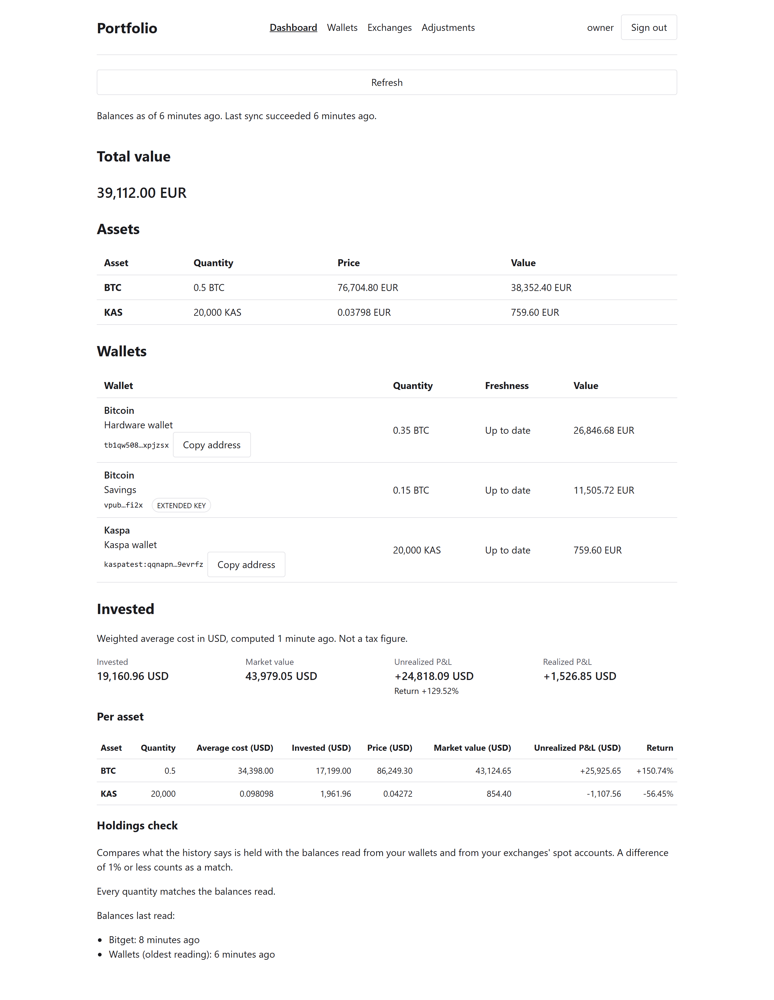

# Portfolio

A self-hosted crypto investment portfolio tracker. It reads balances from on-chain
addresses, imports spot trade executions from exchanges, and answers three questions:

- what is the portfolio worth right now,
- what is each wallet worth,
- how much has actually been invested in each asset.

Single user, single production instance, running on a Raspberry Pi on a home network.



*The dashboard, from a local build on a demo database: test-network wallets and an
invented exchange history, valued at real public prices on the day the picture was taken.
None of it is anyone's portfolio.*

## What it does

| Area | What V1 does |
|---|---|
| On-chain balances | Bitcoin addresses, and single-signature `xpub`, `ypub` and `zpub` keys whose addresses are derived locally up to a gap limit of 20. Kaspa addresses. Read from public explorers on a schedule, Bitcoin with a fallback explorer, and every run logged. |
| Prices | Kraken, Coinbase, the Kaspa API and, with an optional key, CoinGecko, cached and refreshed on a schedule. Holdings are valued in EUR or USD, each priced directly rather than converted from the other. A missing price shows as missing, never as zero. |
| Exchanges | Bitget and BingX. Spot fills are imported incrementally and resume where the last sync stopped; exchange balances are read alongside. The application only reads from an exchange. |
| Accounting | Weighted-average cost basis per asset, in USD, with USDT and USDC taken at one dollar. Realized and unrealized profit and loss. Manual adjustments for opening balances and for coins acquired off the exchanges. |
| Holdings check | The quantity the accounting says is held, compared asset by asset with the balances actually read on-chain and from the exchanges, within a 1% tolerance. |
| Operations | Scheduled SQLite backups with daily and weekly retention, and a restore command. A health page that reports every source. One log line per record, a correlation id per request, and credentials and extended keys redacted from every line. |

The pages are Dashboard, Wallets, Exchanges and Adjustments, and Health at `/health`.

No key that can spend is ever given to it. A wallet is a public address or an extended
public key, and a value that looks like a private key is refused before it is stored.
Exchange keys should be created read-only; `docs/operations.md` says how for each
exchange.

## Running it locally

```bash
cd backend && uv sync && uv run uvicorn portfolio.main:create_app --factory --reload
```

```bash
cd frontend && npm install && npm run dev
```

The frontend dev server proxies `/api` to the backend on port 8000. The backend creates
`backend/data/portfolio.db` on first start and migrates it to the latest schema on every
start.

There is one account. The simplest way to create it is to start the backend once with
`PORTFOLIO_BOOTSTRAP_PASSWORD` set: the first start creates the account `owner` with that
password, and later starts ignore the variable. The other way is the command line:

```bash
cd backend && uv run python -m portfolio create-user
```

Every setting is a `PORTFOLIO_`-prefixed environment variable. They are listed with their
defaults in `backend/src/portfolio/config.py`, and explained where they matter in
[docs/operations.md](docs/operations.md). The defaults read public explorers and price
sources, so beyond the account's password the only thing it needs to be given is exchange
credentials, and only for the exchanges in use.

```bash
python scripts/check.py        # lint, types, layering, tests, coverage, secret scan
```

## Documentation

| Document | What it covers |
|---|---|
| [docs/architecture.md](docs/architecture.md) | The layering, how money is represented, authentication, and the provider abstractions every chain, price source and exchange is built on |
| [docs/accounting.md](docs/accounting.md) | The cost-basis engine, the holdings check and manual adjustments, with worked examples the test suite executes |
| [docs/adr/0001-weighted-average-cost-basis.md](docs/adr/0001-weighted-average-cost-basis.md) | Why weighted-average cost rather than FIFO or specific identification |
| [docs/providers.md](docs/providers.md) | Every external service: the endpoints used, the limits, and which facts are confirmed and which are not |
| [docs/deployment.md](docs/deployment.md) | The pipeline from a merge to a running container, the host layout, and the rollback |
| [docs/operations.md](docs/operations.md) | Running the instance: the account, each source, the schedules, backups, logs, the health detail, and troubleshooting |
| [docs/specs/](docs/specs/) | One spec per issue: what each change set out to do and what it decided. A record, not kept current |

## Stack

Python 3.12 + FastAPI, SQLAlchemy and Alembic on SQLite, React + TypeScript + Vite, one
Docker image serving both the API and the single-page application.

## A note on this repository being public

It is a financial application, so nothing sensitive is ever committed: no API keys, no
wallet addresses, no extended public keys, no infrastructure detail. Those are runtime user
data and live in the database on the host, or in environment variables.

That is enforced in four independent places rather than by discipline alone — a gitleaks
configuration with project-specific rules, a scanner that fails closed, pre-commit and
pre-push hooks, and a CI job that scans the full history. Test fixtures are required to use
testnet addresses, which is what makes the rule mechanically checkable.

## Deployment

Merging to `main` builds an arm64 image, pushes it to the registry by digest, deploys it
over Tailscale, verifies the container is healthy, and only then tags the image and cuts a
release. The host-side script backs up the database before replacing anything and rolls
back if the new container does not become healthy.

See [docs/deployment.md](docs/deployment.md).

## Contributing

This is a personal project and pull requests are not being accepted. The working agreement
for the agents and for me is in [CLAUDE.md](CLAUDE.md).

## License

MIT
